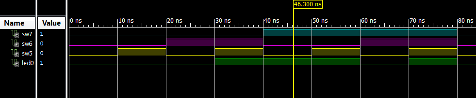

#Computer Exercise #1 - Introduction to Xilinx and FPGA

## By C3C Mark Demore

## Table of Contents
1. [Objectives or Purpose](#objectives-or-purpose)
2. [Preliminary Design](#preliminary-design)
 * [Code](#code)
3. [Software flow chart or algorithms](#software-flow-chart-or-algorithms)
 * [Pseudocode](#pseudocode)
4. [Hardware schematic](#hardware-schematic)
5. [Debugging](#debugging)
6. [Testing methodology or results](#testing-methodology-or-results)
7. [Observations and Conclusions](#observations-and-conclusions)
8. [Documentation](#documentation)
 
### Objectives or Purpose 
The purpose of Computer Exercise 1 was to install all necessary software for the course (Xilinx, MarkdownPad, Git, FPGA board) and gain a basic understanding of how to use it by implementing a basic logic circuit. 

### Preliminary design
Given the nature of this assignment, almost all preliminary design was provided. Please reference the sections below for specifics developed going through the assignment, namely the logic table for the given equation and how it was implemented in the test bench.

#### Code:

#####Test Bench Input Code:
	--------------------------------------------------------------------
	sw7 <= '0'; sw6 <= '0'; sw5 <= '0';
      WAIT for 10 ns;
		
	sw7 <= '0'; sw6 <= '0'; sw5 <= '1';
      WAIT for 10 ns;
		
	sw7 <= '0'; sw6 <= '1'; sw5 <= '0';
      WAIT for 10 ns;
		
	sw7 <= '0'; sw6 <= '1'; sw5 <= '1';
      WAIT for 10 ns;
		
	sw7 <= '1'; sw6 <= '0'; sw5 <= '0';
      WAIT for 10 ns;
		
	sw7 <= '1'; sw6 <= '0'; sw5 <= '1';
      WAIT for 10 ns;
		
	sw7 <= '1'; sw6 <= '1'; sw5 <= '0';
      WAIT for 10 ns;
		
	sw7 <= '1'; sw6 <= '1'; sw5 <= '1';
      WAIT for 10 ns;
	------------------------------------------------------------------------- 

	
### Pseudocode:
AB' + BC = F

| A | B | C | Expected F |

|:-:|:-:|:-:|:----------:|

| 0 | 0 | 0 | 0 |

| 0 | 0 | 1 | 0 |

| 0 | 1 | 0 | 0 |

| 0 | 1 | 1 | 1 |

| 1 | 0 | 0 | 1 |

| 1 | 0 | 1 | 1 |

| 1 | 1 | 0 | 0 |

| 1 | 1 | 1 | 1 |

### Hardware schematic

##### Figure 1: Schematic for logic circuit, as implemented in Xilinx

### Debugging
The only debugging issues encountered in this project were involved in software installation or formatting in MarkdownPad. Install issues were addressed through a series of emails and MarkdownPad problems were dealt with through referencing the example README file provided. At the time of submitting this assignment, some issues with the .gitignore file and SourceTree may persist, resulting in a lack or excess of appropriate files available on bitbucket. I hope that this will be resolved by the time CE2 is submitted.

### Testing methodology or results
| A | B | C | Sim F | Actual F |

|:-:|:-:|:-:|:-----:|:--------:|

| 0 | 0 | 0 | 0 | 0 |

| 0 | 0 | 1 | 0 | 0 |

| 0 | 1 | 0 | 0 | 0 |

| 0 | 1 | 1 | 1 | 1 |

| 1 | 0 | 0 | 1 | 1 |

| 1 | 0 | 1 | 1 | 1 |

| 1 | 1 | 0 | 0 | 0 |

| 1 | 1 | 1 | 1 | 1 |

##### Figure 1: Simulation results from Xilinx using schematic and test bench code

Below: Video of FPGA testing

[YouTube Demo](https://www.youtube.com/watch?v=EFUJNd4x7oY)

### Observations and Conclusions
The most notable observations were the difficulty of setting up the repository. Once all software was set up, designing the logic circuit and implementing it was very straight forward and easy using the given instructions. The ease of use and versatility of this software and the FPGA board seem promising for further use in the course. 

### Documentation
README file based on template provided by Maj Falkinburg

####Feedback
Number of hours spent on CE1: 3ish

Suggestions to improve CE1 in future years: 
Better guidance, perhaps an after school session to help with install issues and better understand what files need to be included, how to set up repository (specifically linking local folder with cloud), and how to use MarkdownPad. I think the number of emails sent regarding this assignment emphasize how useful this could be.