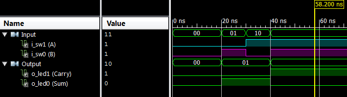

# Computer Exercise #2 - Half-Adder in VHDL

## By Mark Demore II

## Table of Contents
1. [Objectives or Purpose](#objectives-or-purpose)
2. [Preliminary Design](#preliminary-design)
3. [Software flow chart or algorithms](#software-flow-chart-or-algorithms)
6. [Debugging](#debugging)
7. [Testing methodology or results](#testing-methodology-or-results)
8. [Answers to Lab Questions](#answers-to-lab-questions)
8. [Observations and Conclusions](#observations-and-conclusions)
9. [Documentation](#documentation)
 
### Objectives or Purpose 
The goal of this assignment is to gain a basic understanding of VHDL to allow use of Xilinx and the FPGA in future labs and assignments. VHDL allows quick and easy implementation of otherwise complex logical design.

### Software flow chart or algorithms
Most of the code for this exercise was provided and well guided. VHDL lines were added to declare additional inputs and outputs, as well as set testing conditions for simulation. Some logic was added, describing the carry of the half-adder as the AND of the two inputs.

### Debugging
There were no issues debugging. The necessary additions to the VHDL were straight-forward, and the use of the software was explored in CE1. After looking for what was needed, as asked by the exercise instructions, for a brief moment all of the software features were easily discovered and implemented. 

### Testing methodology or results
The system was first tested using the testbench, which simulated the half-adder. The below waveform shows the carry and sum outputs for each of the possible combinations with two inputs.

##### Figure 1: Simulation Results of Half-Adder

After the simulation was ran and results were confirmed. The program was downloaded to the FPGA and tested using the board's switches and LED's. The FPGA test can be found at the link below.

[YouTube Demo](https://www.youtube.com/watch?v=27iUW69iUfU)
### Answers to Lab Questions
How many test cases will you need? 4 in total, because the half-adder takes 2-bit input, and the square of 2 is 4.

### Observations and Conclusions
The purpose of this exercise was achieved. At a basic level, VHDL is beginning to make sense, and the implementation of a circuit using this software is quite obviously much easier and quicker. The simulation and FPGA test were both successful, and a complex chip can be represented in just a few short lines of VHDL.

### Documentation
None