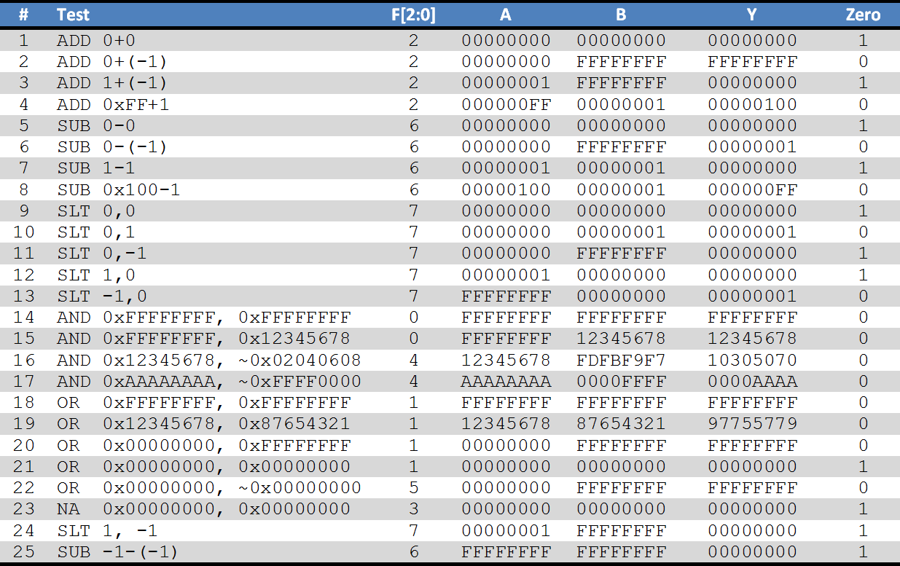
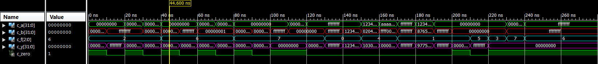
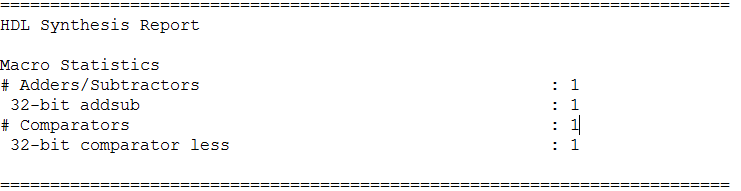
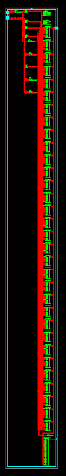
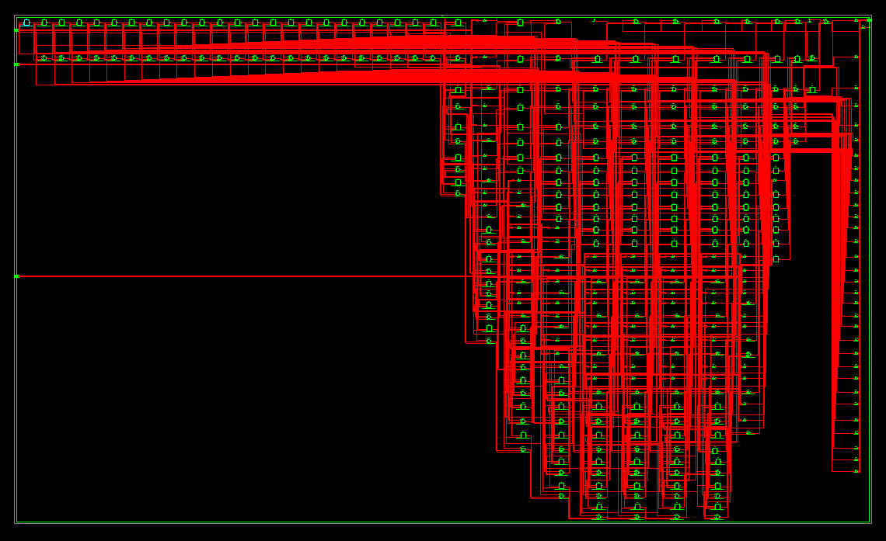

#Computer Exercise #3 - 32-bit ALU

## By Mark Demore II

## Table of Contents
1. [Test Vectors](#test-vectors)
2. [Waveform Results](#waveform-results)
3. [Synthesis Results](#synthesis-results)
4. [Documentation](#documentation)
 
### Test Vectors 
Below are the test cases that were applied to the designed ALU. Cases 1-22 were given, and I came up with Cases 22-25 to further test the design.

##### Figure 1: Test Cases

Case Explanation:

1. This case tests the addition function with two 0 inputs.
2. This case tests the addition function with a zero and negative input.
3. This case tests the addition function with a positive and negative input.
4. This case tests the addition function with two numbers to verify accuracy across all 32-bits.
5. This case tests the subtraction function with two zero inputs.
6. This case tests the subtraction function with a zero and negative input, testing for positive output.
7. This case tests the subtraction function with two positives, testing for a zero output.
8. This case test the subtraction function with two numbers to verify accuracy across all 32-bits.
9. This case tests the set-less-than function with two zero inputs.
10. This case tests the set-less-than function with a zero and positive input.
11. This case tests the set-less-than function with a zero and negative input.
12. This case tests the set-less-than function with a positive and zero input.
13. This case tests the set-less-than function with a zero and negative input, testing for a true output.
14. This case tests the AND function with 32-bit 1 inputs.
15. This case tests the AND function with varying inputs to test accuracy across all 32-bits.
16. This case tests the AND NOT function with varying inputs to test accuracy across all 32-bits.
17. This case tests the AND NOT function with varying inputs to test accuracy across all 32-bits.
18. This case tests the OR function with 32-bit 1 inputs.
19. This case tests the OR function with varying inputs to test accuracy across all 32-bits.
20. This case tests the OR function with 0 and 1 inputs to verify functionality.
21. This case tests the OR function with two zero inputs.
22. This case tests the OR NOT function with two zero inputs.
23. This case tests for the unused function to ensure output is not random.
24. This case tests the set-less-than function for a positive and negative input.
25. This case tests the subtraction function for two negative inputs.

### Waveform Results
The waveform below was the result when running the simulation using the aforementioned test cases and the implemented ALU design.

##### Figure 2: Simulation Waveform

When comparing the waveform to the test table, all outputs match the corresponding input. This verifies the functionality of the ALU. All functions work properly with any potential inputs, within the 32-bit range of course.
	
### Synthesis Results
Below is the report detailing the complexity of the ALU design implemented.

##### Figure 3: Synthesis Report

As shown, a minimal number of parts were used in the design, proving its efficiency in design.

The following figures show how the ALU would be physically wired. The appearance of complexity is a result of the use of 32-bit input.

##### Figure 4: ALU Design - RTL

##### Figure 5: ALU Design - Tech

The disparity between the RTL and Tech schematics results from the components each uses. The RTL design uses gate-level logic. The Tech schematic however, is architecture-specific and uses different elements like look-up tables. Both are optimized by Xilinx during the synthesis process.

### Documentation
Debugging aid from C3C's McFadden and Do

Number of hours spent on CE3: 4

What did you learn?
Better understanding of VHDL

Suggestions to improve CE3 in future years: 
A little more explanation on VHDL beforehand