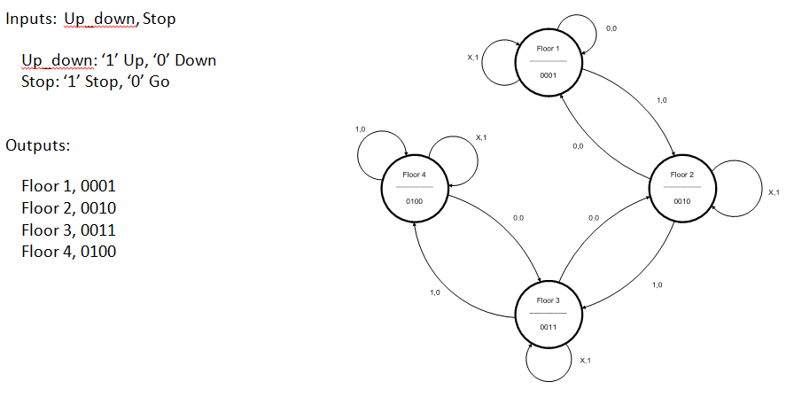
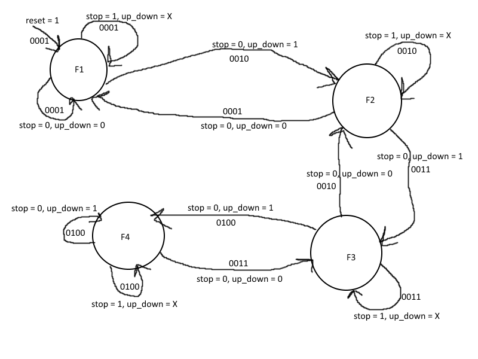
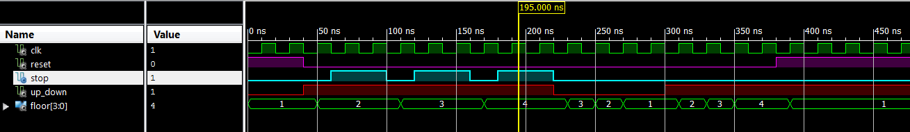
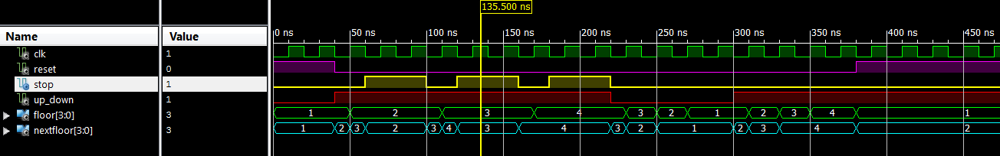

# Computer Exercise #4 - Advanced Elevator Controller

## By Mark Demore II

## Table of Contents
1. [Objectives and Purpose](#objectives-and-purpose)
2. [Preliminary Design](#preliminary-design)
3. [Debugging](#debugging)
4. [Testing Methodology and Results](#testing-methodology-and-results)
5. [Observations and Conclusions](#observations-and-conclusions)
6. [Documentation](#documentation)
 
### Objectives and Purpose 
The goal of this exercise is to successfully implement both a Moore and Mealy design and interpret their output. Some objectives include: increasing understanding of VHDL and the difference between a Moore and Mealy machine.

### Preliminary design
Most of the preliminary design was provided from the outset of the project, as shown in the image below.

##### Figure 1: Provided Moore State Transition Diagram, with inputs and outputs

However, a state transition diagram needed to be created for the Mealy implementation of the elevator state machine.

##### Figure 2: Generated Mealy State Transition Diagram, excluding next_floor output

With this as a basis, the provided shell code was completed to implement this design.

### Debugging
The majority of the debugging was spent with the Mealy machine given the depth of the provided code for the Moore implementation. The nextfloor output for the Mealy design led to a lot of confusion, in which I originally had essentially copied the Moore machine code entirely and ignored the nextfloor output. However, I went back and altered my code to represent state memory, and included next/current state assignments. After this was completed, there was minimal debugging to address syntax in both the shell and testbench files.

### Testing Methodology and Results
Both designs were tested to ensure the functionality of reset, up all four floors, stopping on each floor, and down each floor through a series of test cases. The results of the simulation for each design is shown below.

##### Figure 3: Moore Implementation Waveform

##### Figure 4: Mealy Implementation Waveform

The only difference between the two results is the nextfloor output of the Mealy machine. Both verify the functionality of reset, up, down, and stop. First, reset is tested, followed by going up all four floors, stopping on each for two clock cycles. Then, going down all floors is tested, and finally back up to the fourth floor for a final verification of reset. The Mealy output shows how the elevator utilizes the functionality of a clock, as nextfloor continues to change until stop becomes active before the next clock cycle.

### Observations and Conclusions
Throughout this assignment, a greater understanding of VHDL was enforced, as well as the difference in implementation between the two different designs of a finite state machine, Moore and Mealy. As a result, a Moore machine appears more efficient in some cases, but a Mealy machine provides more detail and output in how it works, with the addition of next state output tied directly to input without interference of the clock.

### Documentation
None

Number of hours spent on CE 4: 3

Suggestions to improve CE 4 in future years: Provide better guidance on the difference in implementation of Moore and Mealy machines

