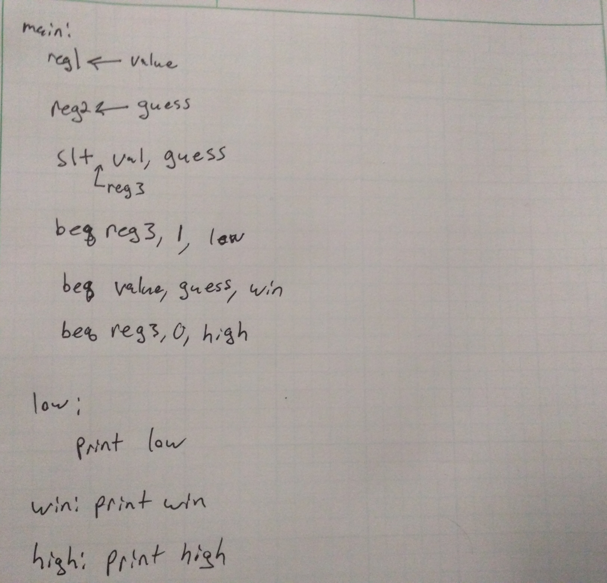
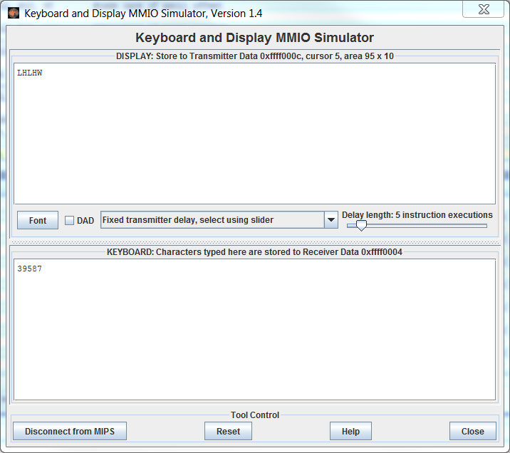

# Computer Exercise #5 - High-Low Game

## By Mark Demore II

## Table of Contents
1. [Objectives or Purpose](#objectives-or-purpose)
2. [Preliminary Design](#preliminary-design)
3. [Testing methodology or results](#testing-methodology-or-results)
4. [Answers to Lab Questions](#answers-to-lab-questions)
5. [Observations and Conclusions](#observations-and-conclusions)
6. [Documentation](#documentation)
 
### Objectives or Purpose 
The objective of this computer exercise is to develop a better understanding of MIPS, specifically with Memory-Mapped I/O.

### Preliminary design
Below is my initial design process, showing how I planned on testing the user entered value against the stored goal value. This did not include specifics on how to read and write data to the MMIO simulator in MARS and included an extra beq line that was not necessary to test for, and was later replaced with a simple j-instruction.

##### Figure 1: Initial Algorithm/Psuedocode
	
### Debugging
All debugging issues were a result of using the MMIO. The biggest issue was not realizing that to output a character, I still needed to alter the value of the ready-bit. Other issues were minor syntax when using the addresses.

### Testing methodology or results
Below are the results of 2 separate test cases, the first with the "random" value of 7, and the second with a value of 4. Both show the program operating correctly.

##### Figure 2: Test Case 1

Test Case 1 was comparing user input to a psuedorandom value of 7. As shown above, the program outputs an L or H for low or high and a W for win once the correct value is guessed. The first value is 3, less than 7, and the program outputs an L. The next value is 9, greater than 7, and outputs an H. This continues until the user enters the correct value, at which point W is printed on the display.

##### Figure 3: Test Case 2

Test Case 2 was comparing user input to a psuedorandom value of 4. As shown above, the program outputs an L or H for low or high and a W for win once the correct value is guessed. The first value is 7, greater than 4, and the program outputs an H. The next value is 3, less than 4, and outputs an L. This continues until the user enters the correct value, at which point W is printed on the display.

### Answers to Lab Questions
1.	What addressing modes did you use in your program?  Give an example line for each type used.
The addressing modes used in my program include, R-type, I-type, and J-type. For example, I-type: lw $t2, 0xFFFF0004	J-type: j high	R-type:	slt $t3, $t2, $t1

2.	Were there any other instructions or pseudo instructions that would have been useful for your program?  Which ones and why?
Some instructions that I think would have been useful are load immediate and load address immediate, which would have been particularly nice for loading and reading values from the MMIO addresses.

3.	Would subroutines have been useful in your program?  Why or why not?
Subroutines may have been useful in comparing the user guess to the random number, returning whether it was less than or perhaps even just printing high or low from the subroutine. However, it obviously was not necessary nor entirely difficult without the use of subroutines.

### Observations and Conclusions
Throughout this assignment I learned much more about how MMIO works and the different ways to reference memory in MIPS.

### Documentation
None

Number of hours spent on CE5: 2

Suggestions to improve CE5 in future years: provide more guidance on how to use MARS MMIO functionality