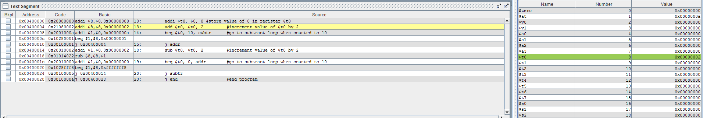

# ICE #2 - Introduction to MIPS

## By Mark Demore II

## Table of Contents
1. [Part 1](#part-1)
2. [Part 2](#part-2)
3. [Documentation](#documentation)

 
### Part 1
The provided program stores 3 values in registers: 5, 20, and 0. It then sums 5 and the incremented, by 4, values of the counter value until the loop exits when the counter reaches 20. The final value of $t0 is 0x2D or 45.

The pictures below show the modified functionality of the program, counting up by 2 from 0 to 10 and back down.

##### Figure 1: Count Up

##### Figure 2: Count Down

### Part 2
I opted to program the divide by 8 bit-shifting calculator. The picture below shows its functionality.

##### Figure 3: Divide by 8

### Documentation
Referenced Stack Overflow and Missouri State to figure out how to use syscall