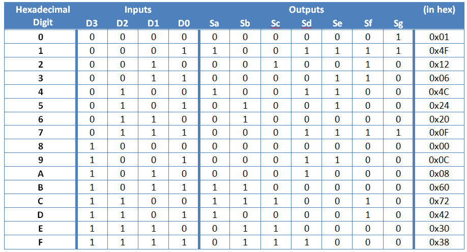

# Lab #1 - Seven-Segment Display Decoder

## By Mark Demore II

## Table of Contents
1. [Objectives or Purpose](#objectives-or-purpose)
2. [Preliminary Design](#preliminary-design)
3. [Debugging](#debugging)
4. [Testing methodology or results](#testing-methodology-or-results)
5. [Answers to Lab Questions](#answers-to-lab-questions)
6. [Observations and Conclusions](#observations-and-conclusions)
7. [Documentation](#documentation)
 
### Objectives or Purpose 
The objective of this lab is to write, test, and implement a seven-segment display decoder on the Nexys2 Board. This is to be accomplished using four-bit input from switches, and a button to select a display to output the correct hex digit.

### Preliminary design
As mentioned in the objectives, the goal of the lab is to create a seven-segment display decoder using 4-bit input.

##### Figure 1: Representation of Decoder

The picture above shows the various segments of the display and how they will be represented in the truth table, connecting the theoretical input to the desired output.

##### Figure 2: Example of Intended Outputs

##### Figure 3: Truth Table for Decoder Design

The above truth table shows how each input will need to be interpreted by the decoder to output the appropriate signals to the seven-segment display in order to show the corresponding hex digit. From here, K-Maps were used to determine the logic that would need to be implemented.

##### Figure 4: K-Map for Output Sa
Logic Equation: Sa = D2D1'D0' + D3D2D1' + D3'D2'D1'D0 + D3D2'D1D0

##### Figure 5: K-Map for Output Sb
Logic Equation: Sb = D3D2D0' + D3D1D0 + D2D1D0' + D3D2D1 + D3'D2D1'D0

##### Figure 6: K-Map for Output Sc
Logic Equation: Sc = D3D2D0' + D3D2D1 + D3'D2'D1D0'

##### Figure 7: K-Map for Output Sd
Logic Equation: Sd = D2'D1'D0 + D2D1D0 + D3'D2D1'D0' + D3D2'D1D0'

##### Figure 8: K-Map for Output Se
Logic Equation: Se = D3'D0 + D2'D1'D0 + D3'D2D1'

##### Figure 9: K-Map for Output Sf
Logic Equation: Sf = D3D2D1' + D3'D2'D0 + D3'D2'D1 + D3'D1D0

##### Figure 10: K-Map for Output Sg
Logic Equation: Sg = D3'D2'D1' + D3'D2D1D0

### Debugging
Some of the biggest issues in debugging this lab arose at the testbench simulation and top-level implementation. In the testbench, there was an issue where the simulation results would be seemingly random for any input. However, after flipping the bit order of the input, this was corrected. Another issue arose in the top-level file, as a result of connecting the decoder ports directly to the outputs and inputs, instead of the created wires. After this was corrected, the program worked on the board, but the switches were flipped so that the left most switch corresponded to the least significant bit. After changing the order of outputs in the port map, this issue was corrected and the board was functional.

### Testing Methodology

##### Figure 11: Simulation Results for 7-Segment Decoder

To verify that the logic was correct for the decoder, the testbench file's simulation was cross referenced with the truth table. Once the logic was debugged using the output from the simulation, comparing input bits with the output hex, the top level file was coded and the implementation was tested on the FPGA board. The testing and proper output can be seen in the video link below.

[YouTube Demo](https://www.youtube.com/watch?v=QbUlfzE8WN4)

### Answers to Lab Questions
For each output, if you had to implement the full SOP or POS equations in hardware, which one would you choose and why?

Sa - Sg: I would use SOP for all of them, because the equations for them are lengthy and using the minterms is much easier to understand and represent using 2-level logic.

Which model do you think is easier for implementing your outputs?

Behavioral Model is far easier, just including the values for which the output should be 1, instead of writing out all of the logic.

Compare the entity interface to the provided constraints (UCF) file.  Do you notice any similarities?

The UCF file and entity interface match the names of logic inputs and outputs in VHDL to the components on the board.

When connecting a button to the 7SD enable pin, why is a NOT gate required?  What would happen if the button were wired directly to the 7SD enable pin?

A NOT gate is required when linking the buttons to the display, because the display is active-low, but the buttons are active-high. Without the not gate, the displays would always be on unless the button was pressed.

### Observations and Conclusions
Throughout Lab 1, my grasp of VHDL was enhanced through implementation. My knowledge of how a decoder works was very useful in the design phase, but was better understood when creating the top level design when wires had to be connected to the various components on the board. Representing and creating components in VHDL will be a huge asset in the future and this lab greatly enhanced my abilities in this area.

### Documentation
None

Number of hours spent on Lab 1: 5

Suggestions to improve Lab 1 in future years: N/A
