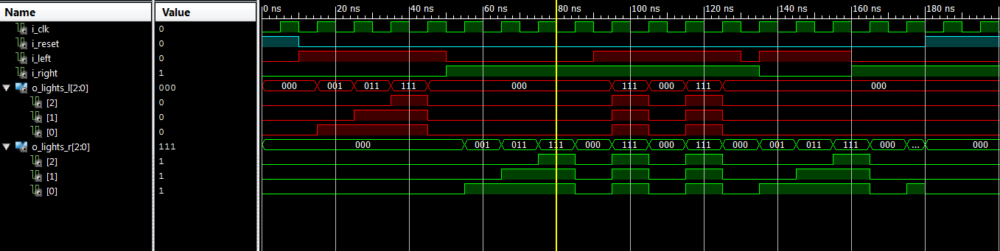

# Lab #2 - Finite State Machines: Thunderbird Turn Signal

## By Mark Demore II

## Table of Contents
1. [Objectives and Purpose](#objectives-and-purpose)
2. [Preliminary Design](#preliminary-design)
3. [State Diagram and Tables](#state-diagram-and-tables)
4. [Hardware Schematic](#hardware-schematic)
5. [Debugging](#debugging)
6. [Testing Methodology and Results](#testing-methodology-and-results)
7. [Answers to Lab Questions](#answers-to-lab-questions)
8. [Observations and Conclusions](#observations-and-conclusions)
9. [Documentation](#documentation)
 
### Objectives and Purpose 
The purpose of this lab was to develop an understanding of Finite State Machines and practice their implementation in VHDL. The resultant objective was to design and implement an FSM that could control the turn signals on the 1965 Ford Thunderbird.

### Preliminary design
In order to create an FSM for the 1965 Ford Thunderbird, a decent understanding of how the tail lights work was necessary.

#### Background Info:

#####Figure 1: Tail Lights of 1965 Ford Thunderbird

#####Figure 2: Sequence for tail lights of Thunderbird

The images above establish the function of the Tbird tail lights, a ripple across the three lights.

### State Diagram and Tables
Once the functionality was realized, the standard design process was used to develop the FSM.

#####Figure 3: State Diagram for FSM
With 3 states for each turn signal being on, a total of 8 states were needed, as shown above. In order to enable a hazard function, the former ghost state was adopted to have all lights on, and transition back and forth between the original state, when both the left and right switches were enabled.

#####Figure 4: State Transition Table for FSM

#####Figure 5: State Output Table for FSM
The tables above show how the inputs effect the states, both current and next, as well as the outputs. These establish the logic necessary to create the FSM.

### Hardware Schematic
**Next-State Equations:**

A* = A'B'C'L'Rreset' + DE'

B* = C

C* = A'B'C'LR'reset' + E'

**Output Equations:**

LA = D'(E+F)

LB = D'E

LC = D'EF'

RA = DF + DE'F'

RB = DF

RC = DEF

The output and next state equations were derived from the tables above and are implemented in the schematic shown below.

#####Figure 6: FSM Schematic

### Debugging
Most of the errors in this lab were from the VHDL code. They were resolved by addressing single errors at a time and referencing old code from previous labs and computer exercises. Another error was that once implemented on the FPGA, the right turn signal sequence was backwards. This was corrected by simply reversing the order in which the right LEDs were connected to the output bus.

### Testing Methodology and Results
Before implementing my design on the FPGA, I created a testbench to ensure my logic was correct.

#####Figure 7: State Diagram for FSM
The output above is the result of that testbench, testing for reset, left, right, hazard, and mid-sequence change of input.

Once my logic was verified, a top level file was necessary to include the clock functionality of the FPGA in a way that would be visible, since the on-board clock is too fast. 

##### Figure 8: Top Level Design
The schematic above shows the FSM implemented with the clk_div element that would slow the on-board clock.

#####Figure 9: RTL Schematic
The above image shows the top level RTL schematic created by Xilinx.

Once the top level file was created and without errors, I programmed the FPGA and verified its functionality, shown in the demo linked below.

[YouTube Demo](https://youtu.be/AD6wpJdQZi8)

#####Figure 10: Synthesis Report from Xilinx
This synthesis report verifies that my compiled code created 8 states for the FSM, and goes into further detail as to how it was implemented and optimized by the compiler.

#####Figure 11: State Encoding from Xilinx Compiler
This table details how each of the states were encoded by the compiler, which differs from the grey encoding that I used in my state diagram. This discrepancy arises because the compiler attempts to optimize the system.

### Answers to Lab Questions
Are you designing a Moore or a Mealy machine?
I chose to design a Moore machine.

### Observations and Conclusions
The purpose of this lab was to develop an understanding of FSMs and increase comprehension of VHDL. This was certainly accomplished, as my comprehension of VHDL vastly improved, connecting the dots that were left uncompleted from Lab 1 on how a top level file works to connect components. Moreover, my understanding of FSMs increased through my design and implementation, particularly when comparing my design to the synthesis of Xilinx.

### Documentation
None

Number of hours spent on Lab 2: 3

Suggestions to improve Lab 2 in future years: Perhaps more clear instructions when it comes to VHDL. Can be easily figured out referencing Lab 1, but might be confusing for some.