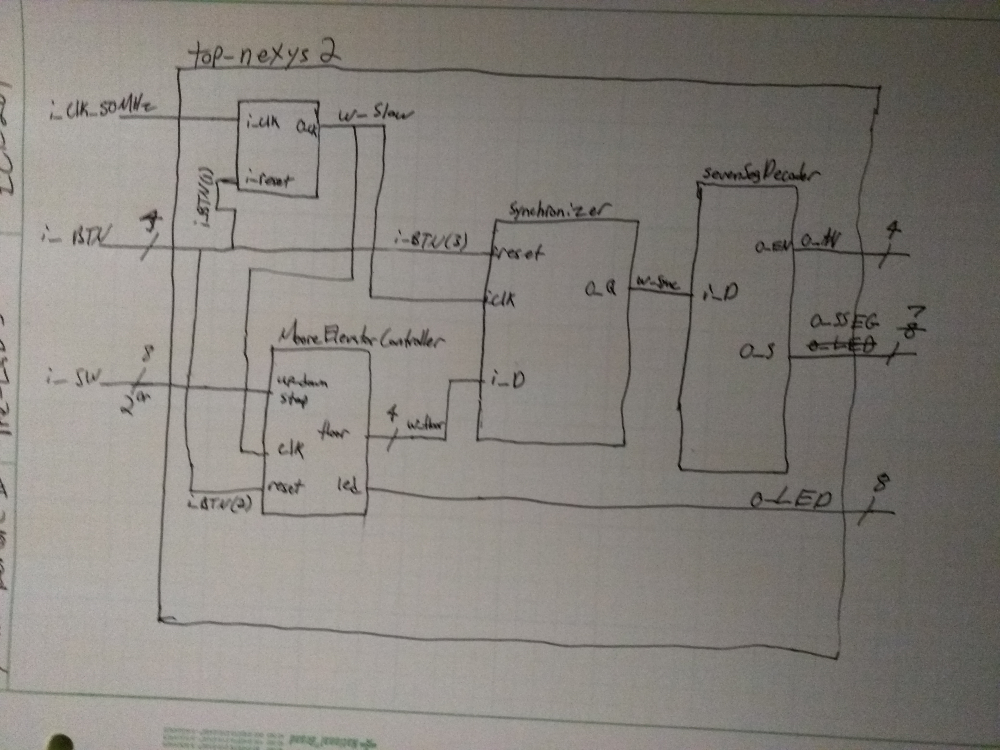
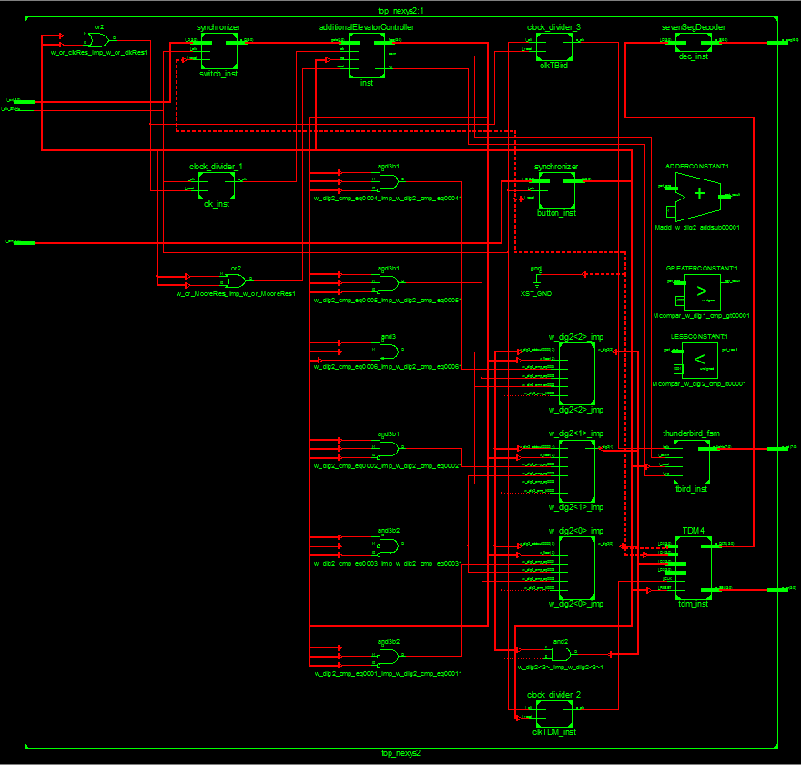

# Lab #3 - Elevator Controller Variations

## By Mark Demore II

## Table of Contents (not required but makes things easy to read)
1. [Objectives or Purpose](#objectives-or-purpose)
2. [Preliminary Design](#preliminary-design)
3. [Hardware schematic](#hardware-schematic)
4. [Debugging](#debugging)
5. [Testing methodology or results](#testing-methodology-or-results)
6. [Answers to Lab Questions](#answers-to-lab-questions)
7. [Observations and Conclusions](#observations-and-conclusions)
8. [Documentation](#documentation)
 
### Objectives or Purpose 
The objective of this lab was to develop a complex system, integrating both sequential and combinational logic. Initially, the system takes input from 2 switches, and the elevator goes to the respective floor, displayed on the 7-Segment display, with accompanying reset buttons for the FSM and clock. The final system takes input from 4 switches to go between 16 different floors, and does not travel until the 'Go' button is pressed, with the current floor displayed on the 7-Segment display and a light pattern indicating movement of the elevator up or down.

### Preliminary design
Most of the lab involved linking previously created files to work together. As such, most of the preliminary design was in developing the top-level schematic in preparation of creating the file. My initial top-level schematic is pictured below.

Figure 1: Pre-Lab Top Level Design

### Hardware schematic
Below is the RTL schematic generated by Xilinx from the top-level file, showing how each component is connected and uses the corresponding input/output.

Figure 2: RTL Schematic

### Debugging
You should be keeping track of issues as you go along.  I didn't have any problems is not a good answer.  Describe the problems you had and what you did to fix it.  Again this is where I would say commit early and often and start your notebook when you start your code.

### Testing methodology or results
Testing involved repetitive programming of the FPGA to verify output with any number of test cases. Each functionality was tested after it was implemented, and again once another functionality was added. Below is a video showing the basic, required functionality.

[YouTube Demo - Required Functionality](https://www.youtube.com/watch?v=sHGgJrRWlMU)

### Answers to Lab Questions
1.	What do you need the synchronizer for (See Sections 3.5.4-3.5.5 of your text book)?  How many bits will you require to be “synchronized” (Hint:  See Figures 1-2)?
The synchronizer is to make the inputs from the buttons and switches usable with the FSMs, the number of bits that need to be synchronized correspond to the number of buttons and switches that make up the input.

2.	What value for k_DIV do you need to produce a 2 Hz clock? 12500000

3.	Notice the Master Reset does not reset both the FSM and clock like it should.  Why not?  Hint:  think about how the other resets work. The FSM reset was dependent upon the clock.

4.	Bonus functionality: What will your design do if both elevators are equally close? N/A, but would design it to default to the left elevator.

5.	What did you learn? It takes a lot of work to make a bunch of different components work together.

### Observations and Conclusions
This lab highlighted the challenges faced when creating complex systems and trying to get multiple components to work together.

### Documentation
Help organizing resets from C3C McFadden

Number of hours spent on Lab 3: 8
 
Suggestions to improve Lab 3 in future years: In-class time for additional functionality would be more useful than time for required functionality. Also, additional vs. required can easily be interpreted as additional = bonus, this was confusing.
