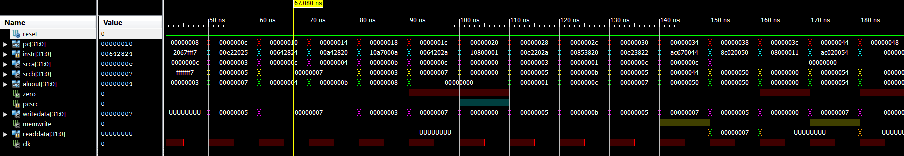

# Lab #4 - MIPS Single-Cycle Processor
## By Mark Demore II

## Table of Contents
1. [Objectives or Purpose](#objectives-or-purpose)
2. [Preliminary Design](#preliminary-design)
3. [Hardware schematic](#hardware-schematic)
4. [Debugging](#debugging)
5. [Testing methodology or results](#testing-methodology-or-results)
6. [Answers to Lab Questions](#answers-to-lab-questions)
7. [Observations and Conclusions](#observations-and-conclusions)
8. [Documentation](#documentation)
 
### Objectives or Purpose 
The goal of this lab was to further understand how a single-cycle processor works and to practice implementing additional functionality to one. By designing the hardware that would add these instructions, a greater understanding of how the processor works and what the instruction actually does is obtained. 

### Preliminary design
Preliminary design of the processor was a result of the initial instruction set and test table, seen below. The initial processor was provided but functionality needed to be verified. After the first test was run and successful, ORI functionality was implemented first through the processor schematic. After ORI was implemented successfully and verified, BNE functionality was added.

##### Figure 1: Completed Table 1

##### Figure 2: Schematic for MIPS Single-Cycle Processor

### Hardware schematic
Below are the altered schematics including ORI and BNE functionality, which was then used to add code to the VHDL file to implement.

##### Figure 3: Schematic for MIPS Single-Cycle Processor with BNE implementation

##### Figure 4: Schematic for MIPS Single-Cycle Processor with ORI implementation

### Debugging
The biggest issues with debugging was managing where signals go within the file. It was very difficult to determine within what sections the signals needed to be declared and connected. After this was sorted out, analyzing all of the different signals on the waveform was challenging as well. Another issue that occurred far too often was running the simulation on files that were not the testbench mistakenly. Once the waveform configuration file was organized, debugging became easier. Ultimately, navigating the mips_combo file was the most challenging part with debugging.

### Testing methodology or results

##### Figure 5: Testbench Results for Initial Test, First 6 Instructions

##### Figure 6: Testbench Results for Remaining 10 Instructions

The waveforms above were obtained using the provided file, with the addition of my ALU, and the given testbench file. This waveform was compared to the table to verify results and functionality of the processor with ALU.

##### Figure 7: Testbench Results for memfile2.dat

The waveform above verifies the functionality of ORI and BNE implementation, based on the instructions for memfile2.dat which are pictured below. The BNE functionality is verified based on the skipping of the jump instruction, and ORI functionality is verified by the value stored in the $t0 register throughout the program, used in the final instruction. When the program finishes, the correct value is stored in the correct address, verifying total functionality.

##### Figure 8: Instructions for memfile2.dat

### Answers to Lab Questions
What address will the final sw instruction write to and what value will it write?	The program should write the value 7 to address 84, for the first instruction set.

What address and data value are written by the sw instruction? The program should write the value 2 to the address 0xFFFF7F54, for the second instruction set.

### Observations and Conclusions
Throughout this assignment I learned that trying to manipulate a massive VHDL file is nearly impossible. Organization and comments are very important in trying to make that work. I also learned that running the simulation on the proper file is crucial to analyzing if your code is functioning properly. In conclusion, implementing additional functionality to a MIPS single-cylce processor can be very straight forward and accomplished in a few lines, if you know where to put it.

### Documentation
None

Number of hours spent on Lab 4: 8

Suggestions to improve Lab 4 in future years:	Better organize the code. Nearly impossible to figure out where to put my signals, components, etc. when scouring through 600+ lines of code that I've never seen before.