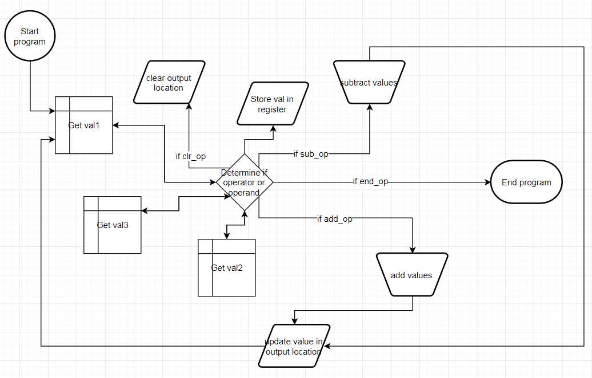
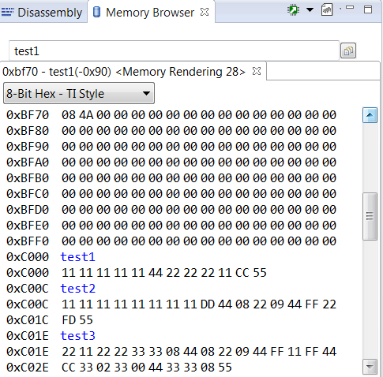
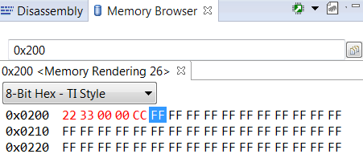
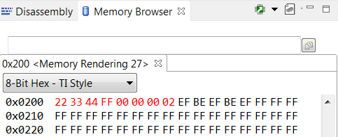
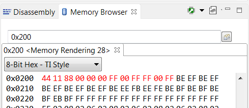

# Lab #1 - Assembly Calculator

## By C2C Mark Demore II

 
### Objectives or Purpose 
The purpose of this lab was to experiment with the various ways of accessing and using memory, as well as familiarize ourselves with the various instructions in the MSP430 architecture.

### Preliminary design
The program was initially designed by flowchart as part of the pre-lab assignment, seen below:

### Testing methodology
The program was tested using the following test cases:

Required Functionality:

B Functionality:

A Functionality:

Test Case 1:
0x05, 0x33, 0x05, 0x55

Expected Result: 0x19

Actual Result: 0x19

Test Case 2:
0x05, 0x11, 0x05, 0x11, 0x05, 0x55

Expected Result: 0x0F

Actual Result: 0x0F

### Design
Between the flowchart and my final program, the main change was the implementation of the multiply function using a bit-shift add.

### Debugging
Most of the debugging occurred with the multiply function, keeping track of what to shift and when to finish adding. After a few iterations, the function was properly implemented.

### Results
Test cases 1 and 2 were both very successful. The provided test cases, however, were only mildly successful. Results ended up stored in incorrect locations and results were sometimes incorrect.

### Observations and Conclusions
Given the intent of the lab, I accomplished most of these goals. With somewhat successful implementation of all functions, accompanied with a fair bit of debugging and analysis of memory, I learned a lot about how the different instructions work and how to access and manipulate various parts of memory.

### Documentation
Inspiration for bit-shift add approach to multiply function obtained from University of Utah Department of Computer Science