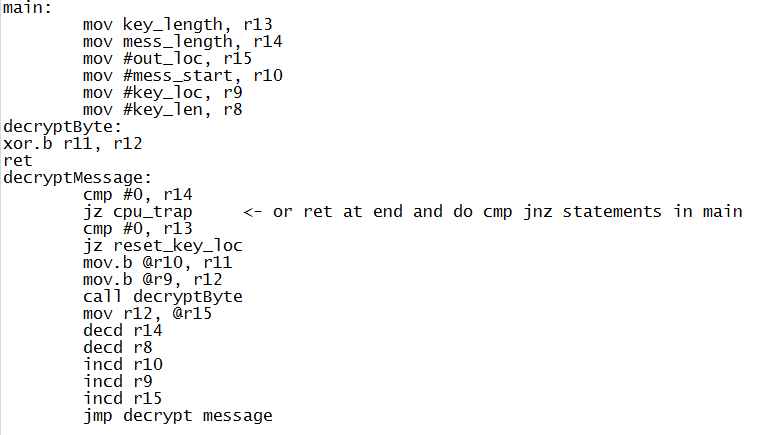

# Lab #2 - Cryptography

## By C2C Mark Demore II

 
### Objectives or Purpose 
The purpose of this lab was to experiment with the various ways of accessing and using memory, as well as practice writing subroutines.

### Preliminary design
The program was initially designed using psuedocode, pictured below:

### Testing methodology
The program was tested using the following test cases:

Required Functionality:
0xef,0xc3,0xc2,0xcb,0xde,0xcd,0xd8,0xd9,0xc0,0xcd,0xd8,0xc5,0xc3,0xc2,0xdf,0x8d,0x8c,0x8c,0xf5,0xc3,0xd9,0x8c,0xc8,0xc9,0xcf,0xde,0xd5,0xdc,0xd8,0xc9,0xc8,0x8c,0xd8,0xc4,0xc9,0x8c,0xe9,0xef,0xe9,0x9f,0x94,0x9e,0x8c,0xc4,0xc5,0xc8,0xc8,0xc9,0xc2,0x8c,0xc1,0xc9,0xdf,0xdf,0xcd,0xcb,0xc9,0x8c,0xcd,0xc2,0xc8,0x8c,0xcd,0xcf,0xc4,0xc5,0xc9,0xda,0xc9,0xc8,0x8c,0xde,0xc9,0xdd,0xd9,0xc5,0xde,0xc9,0xc8,0x8c,0xca,0xd9,0xc2,0xcf,0xd8,0xc5,0xc3,0xc2,0xcd,0xc0,0xc5,0xd8,0xd5,0x8f

Key: 0xac

Result: C	o	n	g	r	a	t	u	l	a	t
i	o	n	s	!	.	.	Y	o	u	.
d	e	c	r	y	p	t	e	d	.	t
h	e	.	E	C	E	3	8	2	.	h
i	d	d	e	n	.	m	e	s	s	a
g	e	.	a	n	d	.	a	c	h	i
e	v	e	d	.	r	e	q	u	i	r
e	d	.	f	u	n	c	t	i	o	n
a	l	i	t	y

B Functionality:
0xf8,0xb7,0x46,0x8c,0xb2,0x46,0xdf,0xac,0x42,0xcb,0xba,0x03,0xc7,0xba,0x5a,0x8c,0xb3,0x46,0xc2,0xb8,0x57,0xc4,0xff,0x4a,0xdf,0xff,0x12,0x9a,0xff,0x41,0xc5,0xab,0x50,0x82,0xff,0x03,0xe5,0xab,0x03,0xc3,0xb1,0x4f,0xd5,0xff,0x40,0xc3,0xb1,0x57,0xcd,0xb6,0x4d,0xdf,0xff,0x4f,0xc9,0xab,0x57,0xc9,0xad,0x50,0x80,0xff,0x53,0xc9,0xad,0x4a,0xc3,0xbb,0x50,0x80,0xff,0x42,0xc2,0xbb,0x03,0xdf,0xaf,0x42,0xcf,0xba,0x50

Key: 0xacdf23

Result: T	h	e	.	m	e	s	s	a	g	e
.	k	e	y	.	l	e	n	g	t	h
.	i	s	.	1	6	.	b	i	t	s
.	.	.	I	t	.	o	n	l	y	.
c	o	n	t	a	i	n	s	.	l	e
t	t	e	r	s	,	.	p	e	r	i
o	d	s	,	.	a	n	d	.	s	p
a	c	e	s

### Design
Between the psuedocode and my final program, the main change was an alteration in how the message and key were accessed in memory.

### Debugging
Most of the debugging occurred with the determining message and key length from their locations in memory.

### Results
The function was successful for both single and multi-byte keys.

### Observations and Conclusions
Given the intent of the lab, I accomplished most of these goals. With successful implementation of all functions, accompanied with a fair bit of debugging and analysis of memory, I learned a lot about how the different instructions work and how to access and manipulate various parts of memory as well as make subroutines reusable and readable.

### Documentation
None