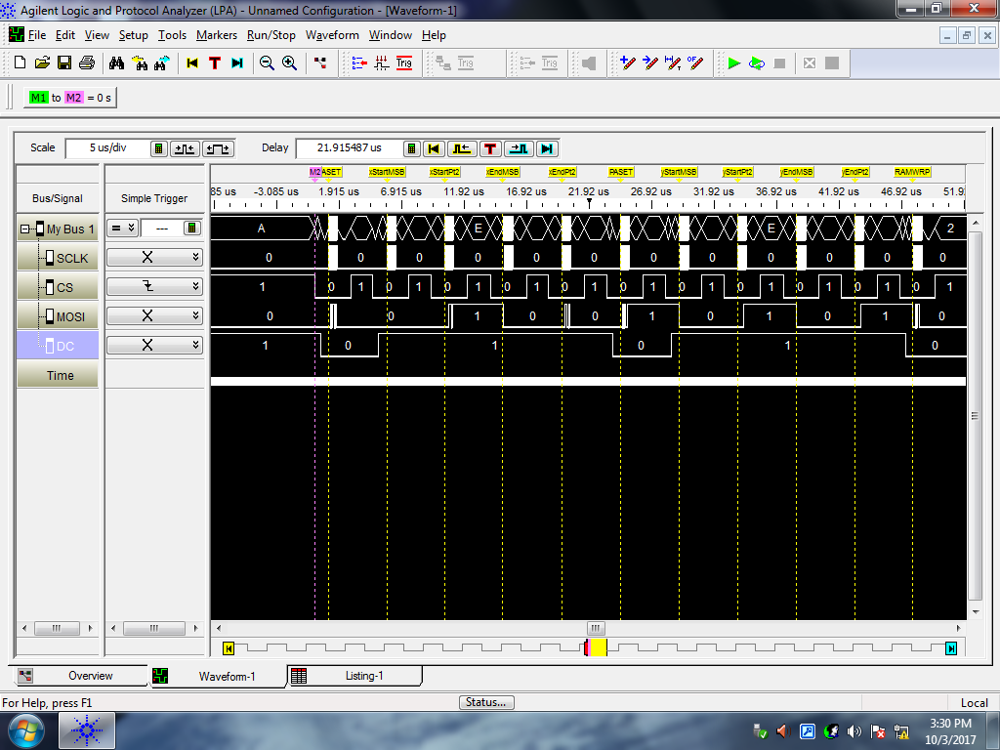

### C2C Mark Demore II

### ECE382

###
# Lab 3 – SPI &quot;I/O&quot;

### **Delay Subroutine**

8MHz \* 160ms = 1280000 cycles

Reference main.asm for coding implementation, instruction cycles in comments.

### **ILI9341 LCD BoosterPack**

Look at the schematic for the LCD BoosterPack. Complete the following table. The pin number (1 - 20) should be the pin number that signal connects to on the MSP 430, and the PX.X should be the pin and port it connects to (e.g. P1.0).

| **Name** | **Pin #** | **PX.X** |
| --- | --- | --- |
| S1 | 5 | 1.3 |
| S2 | 8 | 2.0 |
| S3 | 9 | 2.1 |
| S4 | 10 | 2.2 |
| S5 | 10 | 2.3 |
| MOSI | 15 | 1.7 |
| CS | 2 | 1.0 |
| DC | 6 | 1.4 |
| MISO | 14 | 1.6 |

What are the hex values that need to be combined with the below registers for these signals to be properly configured? State whether that hex value needs to be used with the bis or bic instruction with each register to achieve these ends. If the register is not affected for that signal, simply say N/A.

| **Signal** | **PxDIR** | **PxREN** | **PxOUT** | **PxSEL** | **PxSEL2** |
| --- | --- | --- | --- | --- | --- |
| S1 | bic 0x08 (BIT3) | bis 0x08 | bis 0x08 | bic 0x08 – N/A | bic 0x08 – N/A |
| MOSI | bis 0x80 (BIT7) – N/A | bic 0x80 – N/A | bis 0x80 – N/A | bis 0x80 | bis 0x80 |
| CS | bis 0x01 (BIT0) | bic 0x01 – N/A | bis 0x01 (Active Low) | bic 0x01 – N/A | bic 0x01 – N/A |

### **Configure the MSP430**

Look at the initMSP subroutine in the lab3\_given.asm file. There are four pins being intialized on port 1: SCLK, CS, MOSI, and DC. What is the pin number (1-20) associated with each of these signals? What function does each signal serve? For example, SCLK is the serial clock.

| **Name** | **Pin #** | **Function** |
| --- | --- | --- |
| SCLK | 7/P1.5 | serial clock |
| CS | 2/P1.0 | Chip select |
| MOSI | 15/P1.7 | Master out, slave in |
| DC | 6/P1.4 | Data or command |

Below the pin configuration code are some lines of code from the lab3\_given.asm file (lines 136 - 143) to properly configure the SPI subsystem. Use this code to answer the next two questions.

1:        bis.b    #UCSWRST, &amp;UCB0CTL1

2:        mov     #UCCKPH|UCMSB|UCMST|UCSYNC, &amp;UCB0CTL0

3:        bis     #UCSSEL\_2, &amp;UCB0CTL1

4:        bis     #BIT0, &amp;UCB0BR0

5:        clr    &amp;UCB0BR1

6:        bis    #LCD\_SCLK\_PIN|LCD\_MOSI\_PIN|LCD\_MISO\_PIN, &amp;P1SEL

7:        bis    #LCD\_SCLK\_PIN|LCD\_MOSI\_PIN|LCD\_MISO\_PIN, &amp;P1SEL2

8:        bic    #UCSWRST, &amp;UCB0CTL1

Fill in the chart below with the function that is enabled by the lines 6&amp;7 of the above code. Your device-specific datasheet can help.

| **Pin name** | **Function** |
| --- | --- |
| P1.5 | Set serial clock |
| P1.7 | Set MOSI |
| P1.6 | Set MISO |

Next, describe specifically what happens in each of the eight lines of code above. Line 1 and 3 have been done for you as an example.

Line 1: Setting the UCSWRST bit in the CTL1 register resets the subsystem into a known state until it is cleared.
Line 2: set clock phase, most significant bit, master mode, synchronous
Line 3: The UCSSEL\_2 setting for the UCB0CTL1 register has been chosen, selecting the SMCLK (sub-main clock) as the bit rate source clock for when the MSP 430 is in master mode.
Line 4: set lower bit rate
Line 5: clear upper bit rate
Line 6: set serial clock, mosi, and miso
Line 7: set serial clock, mosi, and miso
Line 8: clear reset

### **Communicate with the LCD**

The following code (lines 297 - 338) sends one byte (either data or command) to the TM022HDH26 display using its 8-bit protocol.

;-------------------------------------------------------------------------------

;    Name: writeCommand

;    Inputs: command in r12

;    Outputs: none

;    Purpose: send a command to the LCD

;    Registers: r12 preserved

;-------------------------------------------------------------------------------

writeCommand:

    push    r12

    bic     #LCD\_CS\_PIN, &amp;P1OUT

    bic        #LCD\_DC\_PIN, &amp;P1OUT

    mov.b     r12, &amp;UCB0TXBUF

pollC:

    bit        #UCBUSY, &amp;UCB0STAT    ;while UCBxSTAT &amp; UCBUSY

    jnz        pollC

    bis        #LCD\_CS\_PIN, &amp;P1OUT

    pop        r12

    ret

;-------------------------------------------------------------------------------

;    Name: writeData

;    Inputs: data to be written in r12

;    Outputs: none

;    Purpose: send data to the LCD

;    Registers: r12 preserved

;-------------------------------------------------------------------------------

writeData:

    push    r12

    bic     #LCD\_CS\_PIN, &amp;P1OUT

    bis    #LCD\_DC\_PIN, &amp;P1OUT

    mov.b     r12, &amp;UCBxTXBUF

pollD:

    bit    #UCBUSY, &amp;UCBxSTAT    ;while UCBxSTAT &amp; UCBUSY

    jnz    pollD

    bis    #LCD\_CS\_PIN, &amp;P1OUT

    pop    r12

    ret

Use this code to draw two timing diagrams (one for each subroutine) of the expected behavior of LCD\_CS\_PIN, LCD\_DC\_PIN, LCD\_SCLK\_PIN, and UCBxTXBUF from the begining of these subroutines to the end. Make sure that you clearly show the relationship of the edges in the clk and data waveforms.

### **Draw a pixel**

The following code (lines 552 - 576) draws a pixel of a predetermined color at the coordinate (R12, R13). However, four subroutines are called to execute this seemingly simple task. Explain the purpose of each of the four subroutine calls:

| **Subroutine** | **Purpose** |
| --- | --- |
| setArea | defines the area you are about to write to for LCD |
| splitColor | splits the color word into color bytes |
| writeData | send data to the LCD |
| writeData | send data to the LCD |

;-------------------------------------------------------------------------------

;    Name: drawPixel

;    Inputs: x in r12, y in r13, where (x, y) is the pixel coordinate

;    Outputs: none

;    Purpose: draws a pixel in a particular spot

;    Registers: r12, 13, 14, 15 preserved

;-------------------------------------------------------------------------------

drawPixel:

    push    r12

    push    r13

    push    r14

    push    r15

    mov.b    r12, r14

    mov.b    r13, r15

    call    #setArea

    mov        #COLOR1, r12

    call    #splitColor

    call    #writeData

    mov        r13, r12

    call    #writeData

    pop        r15

    pop        r14

    pop        r13

    pop        r12

    ret

**Delay**

Figure 1: Clock Speed Measurement

Based on the clock speed as measured by the logic analyzer, it is not actually 8MHz. With a period of 92ns, the clock speed is actually closer to 10.87MHz. This led to some necessary adaptation of the delay subroutine.

Figure 2: Delay Measurement

As shown by the logic analyzer measurement from the adapted blink program, the delay function provides a delay of exactly 160ms.

**Logic Analyzer**

The setArea function determines the area of the LCD that is available for writing, using the CASET and PASET commands to set a rectangle on the display, in which the pixels can be manipulated.

Figure 3: 11 Packets from setArea Function

Figure 4: writeCommand Packet – Packet 1 in Table Below

Figure 5: writeData Packet – Packet 2 in Table Below

| **Packet** | **Line** | **Command/Data** | **8-bit packet** | **Meaning of packet** |
| --- | --- | --- | --- | --- |
| 1 | 404 | Command | 0x2A | CASET (column address set) |
| 2 | 407 | Data | 0x00 | xStart [15:8] |
| 3 | 410 | Data | 0x0D | xStart[7:0] |
| 4 | 414 | Data | 0x00 | xEnd[15:8] |
| 5 | 417 | Data | 0x12 | xEnd[7:0] |
| 6 | 419 | Command | 0x2B | PASET(page address set) |
| 7 | 424 | Data | 0x00 | yStart[15:8] |
| 8 | 427 | Data | 0x07 | yStart[7:0] |
| 9 | 432 | Data | 0x00 | yEnd[15:8] |
| 10 | 435 | Data | 0x07 | yEnd[7:0] |
| 11 | 438 | Command | 0x2C | RAMWRP(memory write, return to start) |

The command bytes (0x2A, 0x2B, 0x2C) make sense, following the logical and literal order the commands would. The data bytes make sense, setting the area to draw the line in, starting at 0x00 and ending at 0x12/0x07 (18pixels/7pixels).