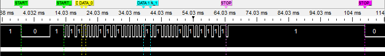
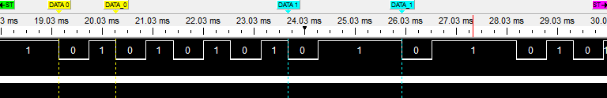
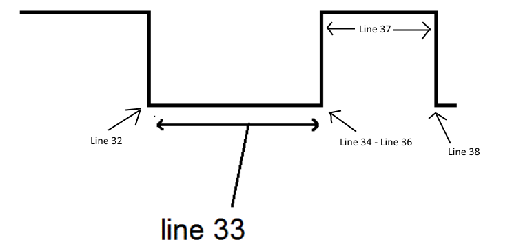

Lab 5

Day 1)

**Question 1: What is the make and model of your remote?**

Remote: HDTV Model: 076E0PV051

**Question 2: What is the total length of your signal from the start bit to the stop bit?**

108.092ms

| Pulse | Duration (ms)	| Timer A counts |
| :-: | :-: | :-: |
| Start -- logic 0 half pulse | 9.0325 | 8965 |
| Start -- logic 1 half pulse | 4.4985 | 4411 | 	 
| Data 1 -- logic 0 half pulse | 594us | 621 | 	 
| Data 1 -- logic 1 half pulse | 1.661 | 1606 |	 
| Data 0 -- logic 0 half pulse | 596.5us | 617 |	 
| Data 0 -- logic 1 half pulse | 537.5us | 502 |	 
| Stop -- logic 0 half pulse | 590.5us | 613 | 
| Stop -- logic 1 half pulse | 43.1 | 42566 |

##### Table 1.  Pulse durations for captured IR signal

**Question 3: How long will it take the timer to roll over?**

65ms

**Question 4: How long does each timer count last?**

1us

Figure 1: Pulse waveform of remote IR signal

Figure 2: Data pulses from remote IR signal

**Question 5: Annotate the picture below to indicate which line of the for loop in the program is executed at which part of the pulse. You should show a total of 6 lines of code (lines 32-34 and lines 36-38).**

Figure 3: Waveform relation to test5.c

| **Data half-pulse** | **Average** | **Std Dev** | **Lower timer count** | **Upper timer count** |
|---------------------|-------------|-------------|-----------------------|-----------------------|
| Data 1 logic 1      |   1611.875  |     11.716  |          1541     |     1683          |
| Data 0 logic 0      |  615.75     |     2.816   |      598          |     633          |
| Data 0 logic 1      |   503.25    |     3.059   |      484          |     522           |

##### Table 2.  Data half-pulse charaterization

| Button | Button name | Hex code (not including start and stop bits) |
| :-: | :-: | :-: |
| 1 | CH+ | 61A050AF |	 
| 2 | CH- | 61A0D02F | 
| 3 | VOL+ | 61A030CF |	 
| 4 | VOL- | 61A0B04F | 
| 5 | MENU | 61A028D7 |	 
| 6 | ENTER | 61A018E7 | 
| 7 | 1 | 61A000FF | 
| 8 | 9 | 61A010EF |
| 9 | 2 | 61A0807F |
| 10 | 3 | 61A040BF |

##### Table 3.  Hexadecimal button codes

**Question 6: Does your button transmit a different code or provide any indication that a button is being held? If so, provide a screenshot with labels and/or explanation.**

A button hold results in a different code. 3 - HOLD: 61A040A1

**Question 7: Given your answer to the previous question, how will you handle held button inputs in your code logic?**

I will ignore button holds.