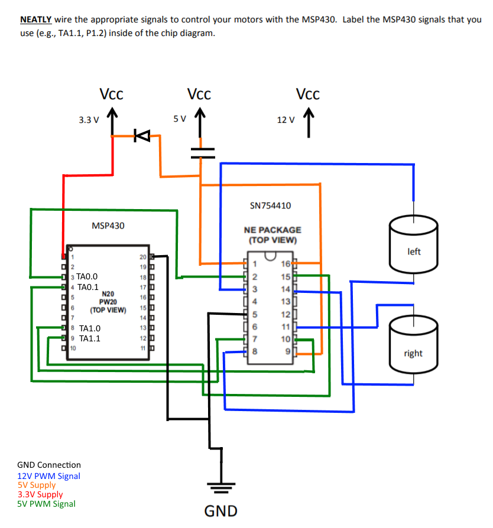

#Pre-Lab:

##Software flowchart and/or pseudo-code

**Which pins will output which signals you need?** 
        Pins 3, 4, 8, and 9 (TA 0.0, 0.1, 1.0, and 1.1 respectively)  
**Which side of the motor will you attach these signals to?** 
        I will attach the signals to the terminal that will drive the wheels forward (in reference to the ultrasonic sensor). If initially the wheels spin backwards, I will reverse the terminal connections.  
**How will you use these signals to achieve forward / back / left / right movement?** 
        The 4 output PWM signals will be associated with forward and backward on the left and right wheels independently. To move forward and backward, the wheels will both move in the same direction at the same speed. Left and right turns will be handled by driving the left and right motors at different speeds.  

**What are the registers you'll need to use?** 
    TACCTL0, TACCTL1, TACCR0, TACCR1   
**Which bits in those registers are important?** 
    TACCTLx - BIT15-14 (CMx), BIT13-12 (CCISx), BIT11 (SCS), BIT8 (CAP), BIT3 (CCI), BIT0 (CCIFG)    TACCRx - BIT15-0  
**What's the initialization sequence you'll need?** 
    1) Set I/O direction (MUX PWM)
    2) Set period
    3) set duty cycle
    4) Enable PWM mode on timer
    5) Configure and start timer 

Figure 1: Lab 6 Schematic 

**Do you want to move each motor invidiually (moveLeftMotorForward())? Or do you want to move them together (moveRobotForward())?** 
    Moving each motor individually will make code more flexible and reusable when implementing turning functionality.   

#####Psuedocode

    Main:
        call initPWM
        call moveForward
        call stop
        call moveBackward
        call stop
        call turnLeft
        call stop
        call turnRight
        call stop
        
    initPWM:
        Initialize PWM signal using steps above

    moveForward:
        set duty cycle for TA0.0 and TA1.0 (left and right positive) to 75%
        
    stop:
        set duty cycle for Timer A (all outputs) to 0%
        
    moveBackward:
        set duty cycle for TA0.1 and TA1.1 (left and right negative) to 75%
        
    turnLeft:
        set duty cycle for TA0.0 (left positive) to 50%
        
    turnRight:
        set duty cycle for TA1.0 (right positive) to 50%