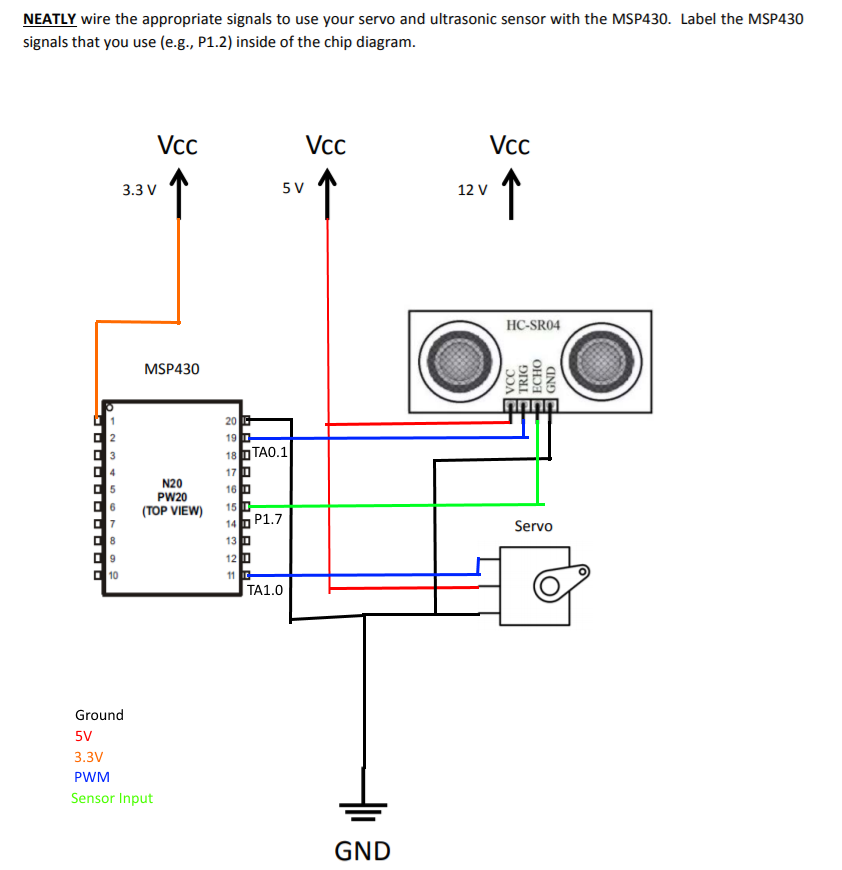

title = 'Lab 7 - "Robot Sensing" Prelab'

# Lab 7 - "Robot Sensing" Prelab

**Name:**    Mark Demore
 
 
**Section:**    M1A
 
 
**Documentation:**    None
 
 
 
Part I - Understanding the Ultrasonic Sensor and Servo
------------------------------------------------------

**Read the datasheets and answer the following numbered questions**

#### Ultrasonic Sensor 
1.  How fast does the signal pulse from the sensors travel in the air?
     340M/s

2.  For every **1 inch** of distance away from the sensor, how long does it take for the sensor pulse to return to the sensor?  For every **1 cm**?     148us, 58us

3.  What is the range and accuracy of the sensor?     2-400cm, accuracy of 3cm

4.  What is the minimum recommended delay cycle (in ms) for using the sensor?  How does this compare to the "working frequency"?     60ms, with 40kHZ - 2400 cycles

    **Going further (optional):**
    Given the max "working frequency", does the maximum sensor range
    make sense?  <u>Hint</u>:  find the maximum unambiguous range.

#### Servo
1.  Fill out the following table identifying the pulse lengths needed for each servo position.  Assume a 1 MHz clock (the actual clock frequency you use can be different).

| Servo Position | Pulse Length (ms) | Pulse Length (counts) |
|----------------|:-----------------:|:---------------------:|
| Left           |         1ms          |          1000      |
| Middle         |         1.5ms        |        1500        |
| Right          |         2ms          |          2000      ||
    
 

Part II - Using the Ultrasonic Sensor and Servo
-----------------------------------------------

1. Create psuedocode and/or flowchart showing how you will *setup* and *use* the ultrasonic sensor and servo.

####Psuedocode
    
    sensorPos = middle
    main:
    initServo
    initSensor
    while(1)
    {
        delay
        checkSensor
        delay
        move
    }
    
    initServo:
    set PWM signal
    
    initSensor:
    set trigger burst signal

    checkSensor:
    send trigger burst
    store echo
    if(wall)
    {
        moveSensor
        checkSensor
    }
    
    moveSensor:
    if(sensorPos = middle)
    {
        pwm = 1ms
        sensorPos = left
    }
    else if(sensorPos = left)
    {
        pwm = 2ms
        sensorPos = right
    }
    else
    {
        pwm = 1.5ms
        sensorPos = middle
    }

2. Create a schematic showing how you will setup the ultrasonic sensor and servo.  A [starter template](images/prelab7_schem.png) is provided, but you may create your drawing in Fritzing or another program if desired.

Figure 1: Lab 7 Schematic

3. Include any other information from this lab you think will be useful in creating your program.  Small snippets from datasheets such as the ultrasonic sensor timing may be good to include.

**Below are some things you should think about as you design your interfaces:**

 - **Consider if/how you will configure the input capture subsystem** for your ultrasonic sensor.  What are the registers you will need to use?  Which bits in those registers are important?  What is the initialization sequence you will need?  Should you put a limit on how long to sense?  If so, how long makes sense given the limitations of the sensor (or the requirements of the project)?

 - **Consider the hardware interface.**  Which signals will you use?  Which pins correspond to those signals?  How will you send a particular pulse width to the servo?

 - **Consider the software interface you will create to your sensor.**  Will you block or use interrupts?  Will you stop moving while you sense?

 - Will the ultrasonic sensor be ready to sense immediately after the servo changes position?  How do you know? 

 - How long should you keep sending PWM pulses?  Keep in mind that you may have to send many PWM pulses before your servo is in the correct position.  Even after that, can you stop sending PWM pulses?
 
 - **Consider how to make your code extensible.**  It will be easier to achieve the bonus functionality of creating an ultrasonic library if you design it right from the beginning.  You should also consider how you will make the sensor, servo, and motors work together.
