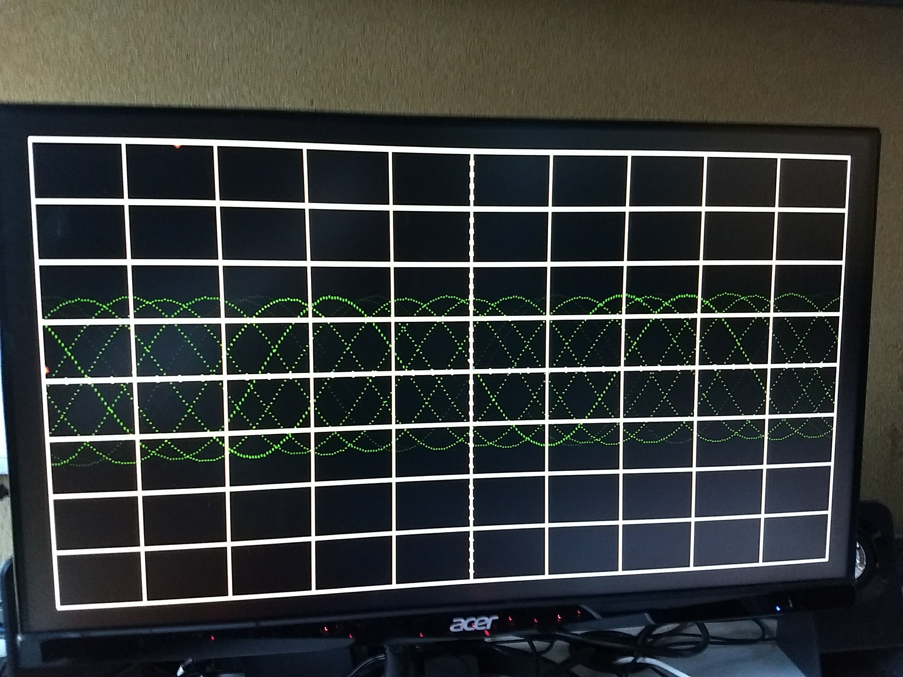

Gate Check 1 complete - verified by Dr. York

Gate Check 2 complete - verified by Dr. York

# Lab 2 - Data Acquisition, Storage and Display

## By C2C Mark Demore II
 
### Introduction
In this lab, I utilized the video blocks from Lab 1 to produce the scopeface image, and feed in signals via an audio port and display the channel on the screen. The main challenge arose in appropriately shifting the input to display properly on the grid, as well as attempting to get triggering to work, which ultimately was left incomplete.

### Implementation
The primary development was in the datapath block, where all of the components came together including blocks from Lab 1, BRAM, and a lot of one line statements dealing with various signals, conversions, et cetera. All of this was controlled by the control unit, implemented via a state machine with four states: RST, WAIT_TRIGGER, WAIT_SAMPLE, and STORE_SAMPLE. Through the control and status words, the control unit worked the counter and BRAM, ultimately determining whether or not the input was useful. BRAM stored the input after converting it into a useful state, which was read by Lab 1 components to determine what to display on the scree.

##### Figure 1: Implementation

### Testing and Debugging
The biggest issues with debugging, besides eternal wait times for bitstream generation, revolved around triggering and shifting. Once all of the components were implemented and connected appropriately, the scope worked, but with the signal along the bottom of the screen. In order to shift it to match the grid, trial and error with simple math was required to shift it; a rather redundant process. Once this functionality was achieved, attempting to get triggering implemented seemed nearly impossible. Swapping out which signal determined the trigger, the order of states in the control unit, and messing with shifting even more were all a part of this process. Sometimes no signal would appear, other times the wavering signal would appear. Ultimately nothing was accomplished.

### Observations and Conclusions
In this lab, the importance of attention to detail was strongly emphasized. Most of the lab was tediously following the diagram given at the begining of the lab; putting a bunch of blocks together and connecting wires. I understand how to get triggering to work as the diagram shows, but I remain quite clueless as to how it should be written in VHDL. The final display for B-functinality is pictured below.

##### Figure 2: Final Display - B Functionality

### Documentation
None