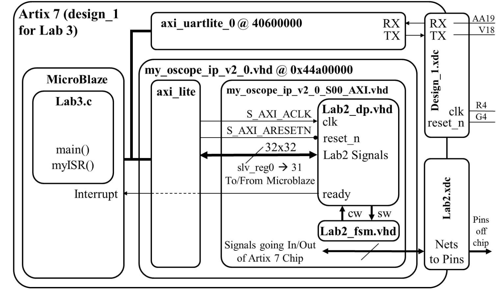
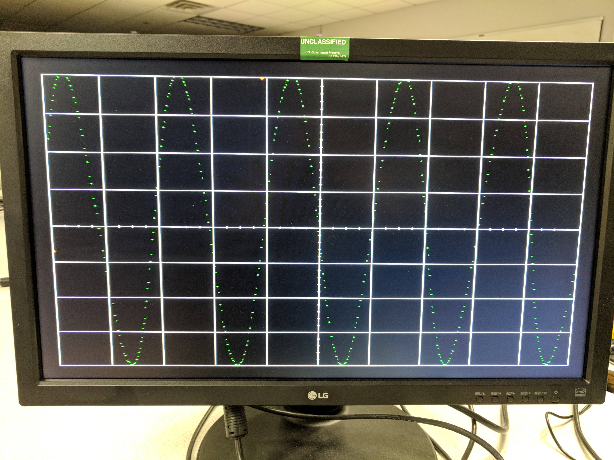

Gate Check 1 Complete - 3/13

Gate Check 2 Complete - 3/13

Required Functionality Complete - 3/15

A-Functionality - 3/19

# Lab 3 - Software Control of a Datapath

## By C2C Mark Demore II
 
### Introduction
In this lab, I utilized my oscilloscope from Lab 2 and connected it to microblaze, allowing it to be interfaced with a C program at a higher level. Connecting signals from my lab 2 datapath to the microblaze processor allowed for registers to be accessed and inputs to be altered by the C program. This was used to provide a signal, triggering, and a basic user interface.

### Implementation
The primary development was in the datapath block and IP files, allowing all of the oscilloscope development from lab 2 to interface with microblaze. From here, all control was done in the C program, communicating with microblaze and lab 2 with registers. The implementation is shown below. The C program was used to control inputs and trigger levels.

##### Figure 1: Implementation

### Testing and Debugging
The biggest issues with debugging, besides eternal wait times for bitstream generation, revolved around getting lab 2 properly connected to microblaze. Once all of the components were implemented and connected appropriately, the scope worked, but with the signal along the bottom of the screen and not properly reading into the C program, and the C program not being able to write an input. In order to shift it to match the grid, trial and error with simple math was required to shift it; a rather redundant process implemented in the C program as opposed to being hardcoded in VHDL. Once this functionality was achieved, attempting to get triggering implemented seemed nearly impossible. Storing the input signal in a buffer array was the first challenge. Once this was achieved, finding the trigger was the next goal. Manipulating the stored signal was the approach, and finally, after realizing that the VHDL code only took the top 10 bits, which actually became the top 8 of the signal based on how it was stored and read from BRAM,I began bitshifting the stored signal to the right 8 bits in order to only perform my trigger finding on the upper 8 bits of the signal. This resolved the issue and I eventually got triggering to work.

### Observations and Conclusions
In this lab, the importance of attention to detail was strongly emphasized. Most of the lab was tediously following the diagram given at the begining of the lab; putting a bunch of blocks together and connecting wires, poking them up through various layers and attempting to read and write to registers in C. Despite spending far too much time on this lab, I did end up implementing interrupts on the ready signal in order to fill my buffer. The final display for functinality is pictured below.

##### Figure 2: Final Display

##### Figure 3: Trigger Finding UI

### Documentation
None